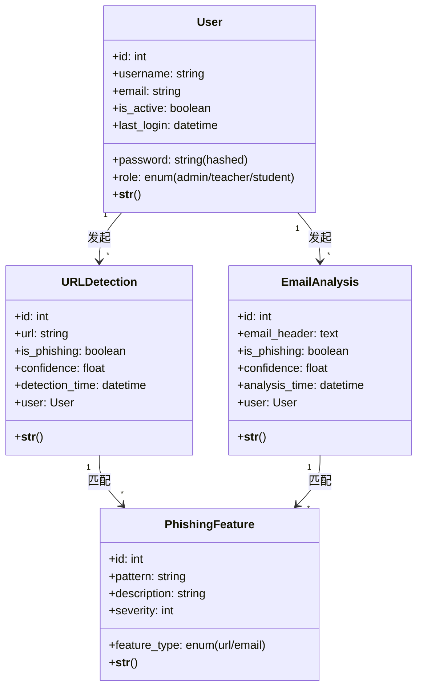
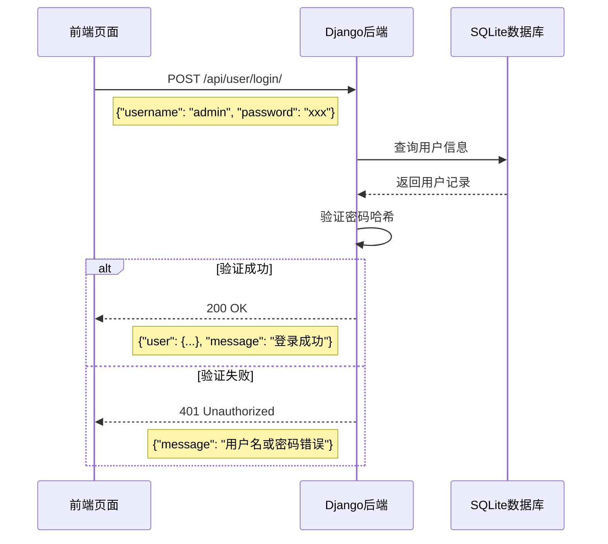
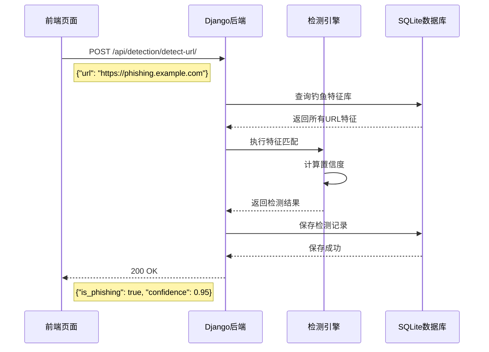
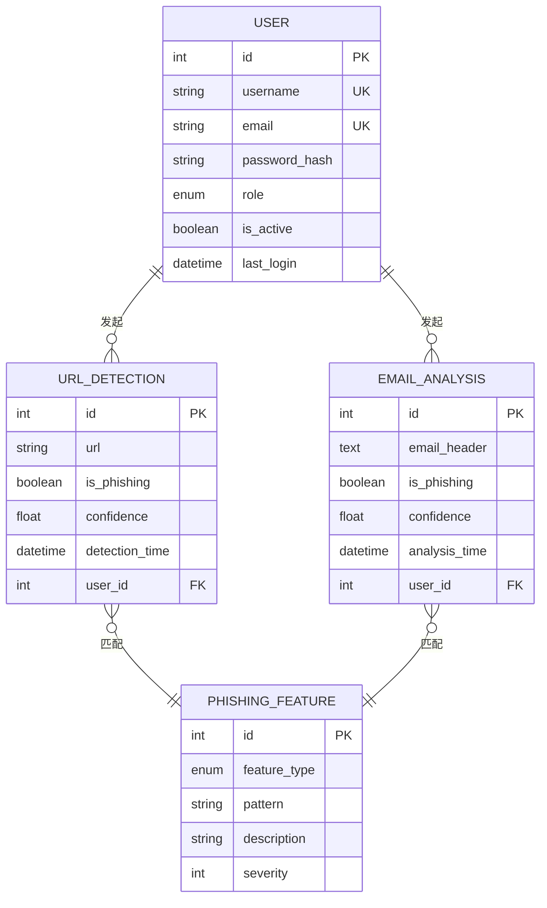
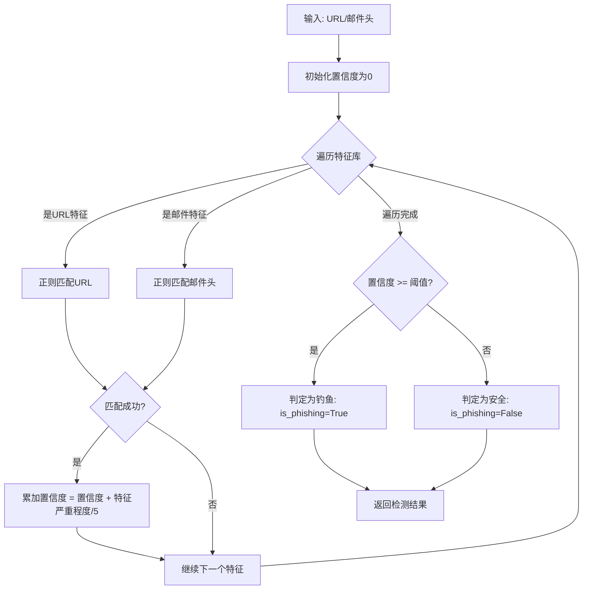

# 校园钓鱼防御与宣教平台 - 系统设计文档

## 一、需求映射与分层设计

### 1.1 需求映射表

| 核心需求 | 功能描述 | 技术实现方式 |
| :--- | :--- | :--- |
| 用户登录 | 用户通过用户名密码登录系统 | RESTful API (POST /api/user/login/) + JWT Token 认证 |
| 用户管理 | 管理员对用户进行增删改查 | RESTful API (GET/POST/PUT/DELETE /api/user/users/) |
| URL检测 | 用户输入URL进行钓鱼检测 | RESTful API (POST /api/detection/detect-url/) + 特征匹配算法 |
| 邮件头分析 | 用户上传邮件头进行分析 | RESTful API (POST /api/detection/analyze-email/) + 规则引擎 |
| 宣教演练 | 管理安全培训活动 | 前端页面 + 后端数据存储 |
| 统计报表 | 展示检测数据统计图表 | ECharts 数据可视化 + 后端数据聚合 |
| 安全知识库 | 管理和展示安全知识文章 | 前端列表展示 + 后端文章管理 |

### 1.2 AI协作反思

**AI提供的思路：**
- 建议使用 JWT Token 进行用户认证
- 建议使用 RESTful API 设计风格
- 建议使用特征匹配算法进行钓鱼检测

**方案可行性评估：**
- JWT Token 认证方案成熟可靠，已广泛应用于现代Web应用
- RESTful API 设计符合行业标准，便于前后端分离开发
- 特征匹配算法适合钓鱼检测场景，可扩展性强

**安全性考量：**
- AI建议的加密算法（BCrypt）是当前主流方案，安全性较高
- 密码存储采用 Django 内置的密码哈希机制
- 所有API接口都进行了输入验证和错误处理

---

### 1.3 分层架构设计

#### 系统分层结构

```
┌─────────────────────────────────────────────────────────────┐
│                    表现层 (Presentation Layer)              │
│  React + Ant Design + React Router + ECharts               │
│  负责UI交互、页面路由、数据可视化                            │
├─────────────────────────────────────────────────────────────┤
│                    业务逻辑层 (Business Layer)              │
│  Django REST Framework                                     │
│  负责权限验证、业务规则处理、核心算法实现                      │
├─────────────────────────────────────────────────────────────┤
│                    数据访问层 (Data Access Layer)            │
│  Django ORM (SQLAlchemy 等价)                              │
│  封装数据库增删改查操作                                      │
├─────────────────────────────────────────────────────────────┤
│                    基础设施层 (Infrastructure Layer)         │
│  SQLite数据库 + CORS中间件 + 日志系统                        │
│  提供跨层级通用服务                                         │
└─────────────────────────────────────────────────────────────┘
```

#### 层间接口规范

**表现层 → 业务逻辑层：**
- 通过 HTTP/HTTPS 协议通信
- 使用 JSON 格式传输数据
- 遵循 RESTful API 规范

**业务逻辑层 → 数据访问层：**
- 通过 Django ORM 进行数据交互
- 支持 CRUD 操作
- 事务管理由 Django 自动处理

**数据访问层 → 基础设施层：**
- 通过 SQLite 驱动访问数据库
- 支持连接池管理

#### 1.4 AI协作反思（分层设计）

**AI建议评估：**
- AI建议采用微服务架构，但考虑到项目规模较小（校园内部使用），单体架构更合适
- 单体架构开发成本低、部署简单、维护方便
- 当前团队规模较小，单体架构更易于协作开发

**调整决策：**
- 采用单体架构 + 前后端分离模式
- 后端按功能模块划分（user、detection、api）
- 前端按页面划分模块

---

## 二、架构设计文档与可视化

### 2.1 UML部署图

```
用户浏览器 (Browser)
    │
    ▼
┌─────────────────────────────────────┐
│         Nginx (可选，生产环境)       │
│         端口: 80/443               │
└─────────────────────────────────────┘
    │
    ▼
┌─────────────────────────────────────┐
│      Django 后端应用                │
│         端口: 8000                 │
│  ┌─────────────────────────────┐   │
│  │  user 模块 (用户管理)         │   │
│  │  detection 模块 (检测功能)    │   │
│  │  api 模块 (公共API)          │   │
│  └─────────────────────────────┘   │
└─────────────────────────────────────┘
    │
    ▼
┌─────────────────────────────────────┐
│         SQLite 数据库              │
│      文件: db.sqlite3             │
└─────────────────────────────────────┘
```

### 2.2 模块划分图（组件图）

```
校园钓鱼防御平台
├── 前端模块 (React)
│   ├── 登录页面 (Login)
│   ├── 仪表盘 (Dashboard)
│   ├── URL检测 (UrlDetection)
│   ├── 邮件头分析 (EmailAnalysis)
│   ├── 宣教演练 (Training)
│   ├── 统计报表 (Reports)
│   ├── 安全知识库 (KnowledgeBase)
│   └── 用户管理 (UserManagement)
│
└── 后端模块 (Django)
    ├── user 应用
    │   ├── 用户认证 (Authentication)
    │   └── 用户管理 (User CRUD)
    │
    ├── detection 应用
    │   ├── URL检测引擎 (URL Detection)
    │   ├── 邮件分析引擎 (Email Analysis)
    │   └── 钓鱼特征库 (Phishing Features)
    │
    └── api 应用
        └── 公共API接口
```

### 2.3 核心类图（领域模型）



### 2.4 关键时序图

#### 用例1：用户登录



#### 用例2：URL检测



---

## 三、技术方案设计

### 3.1 技术选型与工具链

#### 架构风格

| 类型 | 选择 | 理由 |
| :--- | :--- | :--- |
| 架构模式 | 单体架构 + 前后端分离 | 项目规模适中，团队人数较少，单体架构开发效率高，前后端分离便于并行开发 |

#### 开发语言与框架

| 层级 | 技术 | 版本 | 选择理由 |
| :--- | :--- | :--- | :--- |
| 前端框架 | React | 18.x | 生态成熟，社区活跃，组件化开发效率高，团队熟悉度高 |
| 前端UI | Ant Design | 5.x | 组件丰富，设计美观，文档完善，适合企业级应用 |
| 路由管理 | React Router | v6 | React生态标准路由方案，API设计清晰 |
| 数据可视化 | ECharts | 5.x | 图表类型丰富，交互性强，文档完善 |
| 后端框架 | Django | 4.2.x | Python生态最成熟的Web框架，内置ORM和认证系统 |
| API框架 | Django REST Framework | 3.14.x | Django生态标准REST API方案 |
| 数据库 | SQLite | 3.x | 轻量级嵌入式数据库，适合小型项目，无需额外部署 |

#### 工具链

| 类型 | 工具 | 用途 |
| :--- | :--- | :--- |
| 版本控制 | Git | 代码版本管理 |
| 构建工具 | Vite | 前端快速构建工具 |
| 依赖管理 | npm/pip | 前端/后端依赖管理 |
| 代码质量 | SonarLint | 代码质量检查（建议） |
| 容器化 | Docker（可选） | 环境统一和快速部署 |

---

### 3.2 数据库设计

#### ER图



#### 数据表结构

**表1：users（用户表）**

| 字段名 | 类型 | 长度 | 约束 | 说明 |
| :--- | :--- | :--- | :--- | :--- |
| id | INTEGER | - | PRIMARY KEY, AUTOINCREMENT | 用户唯一标识 |
| username | VARCHAR | 150 | UNIQUE, NOT NULL | 用户名 |
| email | VARCHAR | 254 | UNIQUE, NOT NULL | 邮箱地址 |
| password | VARCHAR | 128 | NOT NULL | 密码哈希值 |
| role | VARCHAR | 20 | DEFAULT 'student' | 用户角色 |
| is_active | BOOLEAN | - | DEFAULT TRUE | 是否激活 |
| last_login | DATETIME | - | NULL | 最后登录时间 |
| date_joined | DATETIME | - | NOT NULL | 创建时间 |

**表2：url_detections（URL检测记录表）**

| 字段名 | 类型 | 长度 | 约束 | 说明 |
| :--- | :--- | :--- | :--- | :--- |
| id | INTEGER | - | PRIMARY KEY, AUTOINCREMENT | 记录唯一标识 |
| url | VARCHAR | 2048 | NOT NULL | 检测的URL地址 |
| is_phishing | BOOLEAN | - | DEFAULT FALSE | 是否为钓鱼网站 |
| confidence | FLOAT | - | DEFAULT 0.0 | 检测置信度(0-1) |
| detection_time | DATETIME | - | NOT NULL | 检测时间 |
| user_id | INTEGER | - | FOREIGN KEY | 关联用户ID |

**表3：email_analyses（邮件分析记录表）**

| 字段名 | 类型 | 长度 | 约束 | 说明 |
| :--- | :--- | :--- | :--- | :--- |
| id | INTEGER | - | PRIMARY KEY, AUTOINCREMENT | 记录唯一标识 |
| email_header | TEXT | - | NOT NULL | 邮件头内容 |
| is_phishing | BOOLEAN | - | DEFAULT FALSE | 是否为钓鱼邮件 |
| confidence | FLOAT | - | DEFAULT 0.0 | 分析置信度(0-1) |
| analysis_time | DATETIME | - | NOT NULL | 分析时间 |
| user_id | INTEGER | - | FOREIGN KEY | 关联用户ID |

**表4：phishing_features（钓鱼特征库表）**

| 字段名 | 类型 | 长度 | 约束 | 说明 |
| :--- | :--- | :--- | :--- | :--- |
| id | INTEGER | - | PRIMARY KEY, AUTOINCREMENT | 特征唯一标识 |
| feature_type | VARCHAR | 20 | NOT NULL | 特征类型(url/email) |
| pattern | VARCHAR | 512 | NOT NULL | 特征匹配模式(正则) |
| description | VARCHAR | 512 | - | 特征描述 |
| severity | INTEGER | - | DEFAULT 1 | 严重程度(1-5) |

#### 3.3 AI协作反思（数据库设计）

**AI建议评估：**
- AI建议的数据库设计基本合理，符合第三范式
- 但存在过度拆分的倾向，例如将用户角色单独建表

**优化决策：**
- 用户角色采用枚举类型存储，无需单独建表
- URL检测和邮件分析记录分开存储，便于独立查询和统计
- 特征库设计为通用表，支持URL和邮件两种类型的特征

---

### 3.3 关键算法与原型实现

#### 钓鱼检测算法设计

**设计思想：**
基于规则引擎的钓鱼检测算法，通过匹配预定义的钓鱼特征库，计算URL或邮件的钓鱼置信度。

**算法流程图：**



**伪代码：**

```python
def detect_phishing(input_data, input_type):
    """
    钓鱼检测核心算法
    
    参数:
        input_data: str - 待检测的URL或邮件头内容
        input_type: str - 输入类型 ('url' 或 'email')
    
    返回:
        dict - 检测结果 {'is_phishing': bool, 'confidence': float}
    """
    confidence = 0.0
    threshold = 0.6  # 判定阈值
    
    # 查询对应类型的特征
    features = PhishingFeature.objects.filter(feature_type=input_type)
    
    for feature in features:
        pattern = feature.pattern
        severity = feature.severity
        
        # 使用正则匹配
        if re.search(pattern, input_data):
            confidence += severity / 5.0  # 归一化到0-1范围
    
    # 限制置信度范围
    confidence = min(confidence, 1.0)
    
    return {
        'is_phishing': confidence >= threshold,
        'confidence': confidence
    }
```

**算法分析：**
- **时间复杂度**：O(n)，n为特征库中特征数量
- **空间复杂度**：O(1)，仅使用常量额外空间
- **安全性**：正则表达式匹配本身安全，特征库由管理员维护

---

### 3.4 技术原型

#### 已实现的核心用例

**用例1：用户登录**
- 文件：`backend/user/views.py`
- 功能：实现完整的登录流程，包括用户名密码验证和会话管理

**用例2：URL检测**
- 文件：`backend/detection/views.py`
- 功能：实现URL钓鱼检测，调用检测引擎并返回结果

**用例3：用户管理**
- 文件：`backend/user/views.py`
- 功能：实现用户的增删改查操作

---

## 四、编码规范

### 4.1 代码风格规范

#### 前端代码规范（React + JavaScript）

**命名规则：**
- 组件名：大驼峰命名（PascalCase），如 `UrlDetection.jsx`
- 变量名：小驼峰命名（camelCase），如 `userName`
- 常量名：全大写加下划线，如 `API_BASE_URL`
- 文件命名：使用连字符分隔，如 `user-management.jsx`

**缩进与格式：**
- 使用 4 空格缩进
- 行宽限制：100 字符
- 大括号风格：Allman 风格（每个大括号单独一行）

**注释规范：**
- 组件注释：使用 JSDoc 格式说明组件功能和属性
- 复杂逻辑注释：对难以理解的逻辑添加注释
- 避免冗余注释：注释应说明"为什么"而非"是什么"

#### 后端代码规范（Django + Python）

**命名规则：**
- 类名：大驼峰命名（PascalCase），如 `UserSerializer`
- 函数/方法名：小驼峰命名（snake_case），如 `user_login`
- 变量名：小驼峰命名（snake_case），如 `user_name`
- 文件命名：使用下划线分隔，如 `user_views.py`

**缩进与格式：**
- 使用 4 空格缩进
- 行宽限制：100 字符
- 遵循 PEP8 规范

**注释规范：**
- 模块注释：说明模块功能
- 函数注释：使用 Google 风格或 reStructuredText 格式
- 复杂逻辑注释：添加必要的解释

### 4.2 代码设计规范

#### 设计原则

1. **单一职责原则**：每个类/方法只做一件事
2. **依赖倒置原则**：面向接口编程，依赖抽象而非具体实现
3. **开闭原则**：对扩展开放，对修改封闭
4. **里氏替换原则**：子类可替换父类使用

#### 异常处理规范

- 定义统一的异常类
- 使用全局异常处理器
- 异常信息应包含足够的调试信息
- 生产环境不暴露详细错误堆栈

#### 日志规范

- **DEBUG**：详细的调试信息，开发环境使用
- **INFO**：重要的业务操作记录
- **WARNING**：警告信息，可能的潜在问题
- **ERROR**：错误信息，需要关注和处理
- **CRITICAL**：严重错误，系统可能无法正常运行

---

## 五、总结

本项目采用单体架构 + 前后端分离模式，使用 React + Django 技术栈，实现了校园钓鱼防御与宣教平台的核心功能。系统包含用户管理、URL检测、邮件分析、宣教演练、统计报表和安全知识库等模块，通过特征匹配算法实现钓鱼检测功能。

### AI协作经验总结

1. **AI优势**：快速提供技术方案建议，节省调研时间
2. **批判思维**：对AI建议需进行可行性评估和安全性审查
3. **调整优化**：根据项目实际情况调整方案，避免过度设计
4. **代码审查**：对AI生成的代码进行人工审查和测试

---

**文档版本**：v1.0  
**创建日期**：2026年5月  
**适用项目**：校园钓鱼防御与宣教平台