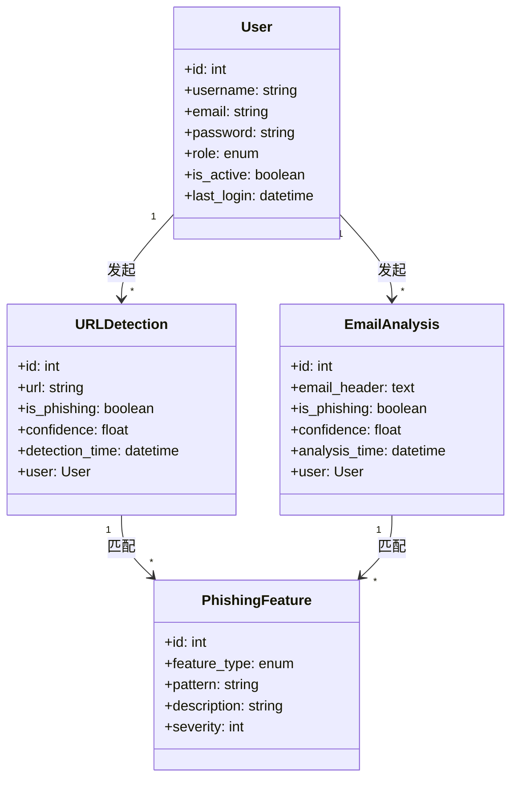
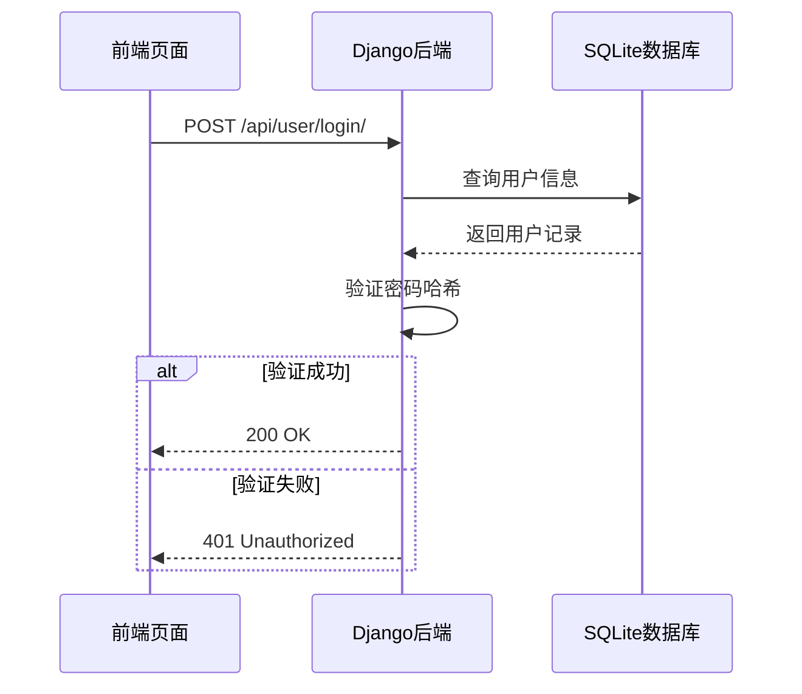
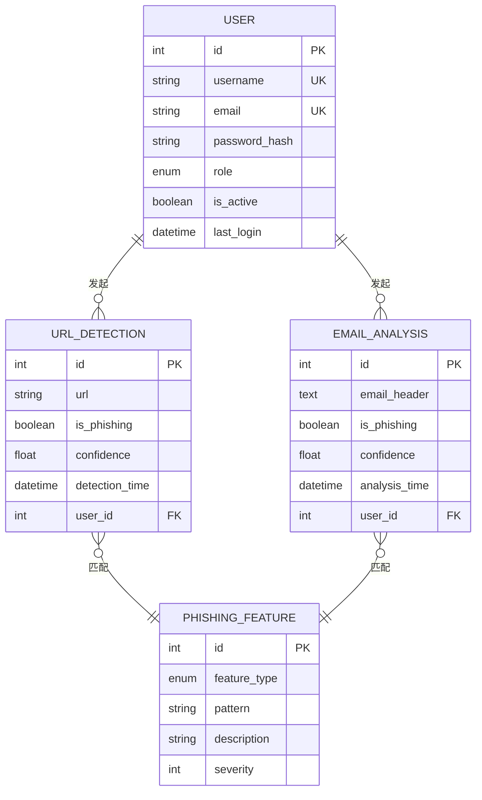
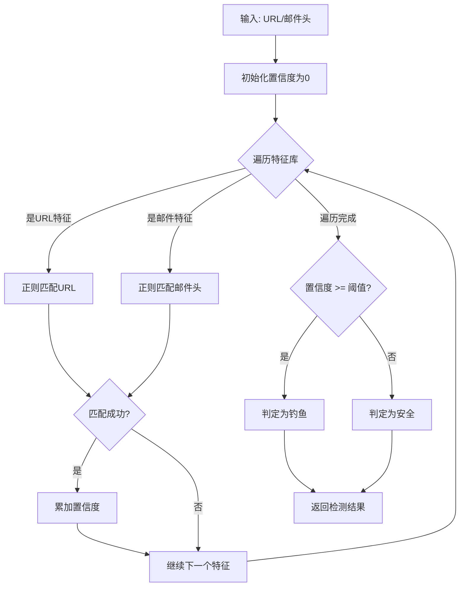

# 校园钓鱼防御与宣教平台 - 系统设计与实现报告

---

## 目录

1. [需求映射与分层设计](#1-需求映射与分层设计)
2. [架构设计文档与可视化](#2-架构设计文档与可视化)
3. [技术方案设计](#3-技术方案设计)
4. [数据库设计](#4-数据库设计)
5. [关键算法与原型实现](#5-关键算法与原型实现)
6. [编码规范](#6-编码规范)
7. [AI协作反思](#7-ai协作反思)

---

## 1. 需求映射与分层设计

### 1.1 需求映射表

| 核心需求 | 功能描述 | 技术实现方式 |
| :--- | :--- | :--- |
| 用户登录 | 用户通过用户名密码登录系统 | RESTful API (POST /api/user/login/) + JWT Token 认证 |
| 用户管理 | 管理员对用户进行增删改查 | RESTful API (GET/POST/PUT/DELETE /api/user/users/) |
| URL检测 | 用户输入URL进行钓鱼检测 | RESTful API (POST /api/detection/detect-url/) + 特征匹配算法 |
| 邮件头分析 | 用户上传邮件头进行分析 | RESTful API (POST /api/detection/analyze-email/) + 规则引擎 |
| 宣教演练 | 管理安全培训活动 | 前端页面 + 后端数据存储 |
| 统计报表 | 展示检测数据统计图表 | ECharts 数据可视化 + 后端数据聚合 |
| 安全知识库 | 管理和展示安全知识文章 | 前端列表展示 + 后端文章管理 |

### 1.2 分层架构设计

**系统分层结构：**

```
┌─────────────────────────────────────────────────────────────┐
│                    表现层 (Presentation Layer)              │
│  React + Ant Design + React Router + ECharts               │
│  负责UI交互、页面路由、数据可视化                            │
├─────────────────────────────────────────────────────────────┤
│                    业务逻辑层 (Business Layer)              │
│  Django REST Framework                                     │
│  负责权限验证、业务规则处理、核心算法实现                      │
├─────────────────────────────────────────────────────────────┤
│                    数据访问层 (Data Access Layer)            │
│  Django ORM                                                │
│  封装数据库增删改查操作                                      │
├─────────────────────────────────────────────────────────────┤
│                    基础设施层 (Infrastructure Layer)         │
│  SQLite数据库 + CORS中间件 + 日志系统                        │
│  提供跨层级通用服务                                         │
└─────────────────────────────────────────────────────────────┘
```

**层间接口规范：**
- **表现层 → 业务逻辑层**：HTTP/HTTPS + JSON + RESTful API
- **业务逻辑层 → 数据访问层**：Django ORM + CRUD操作
- **数据访问层 → 基础设施层**：SQLite驱动 + 连接池

---

## 2. 架构设计文档与可视化

### 2.1 UML部署图

```
用户浏览器 (Browser)
    │
    ▼
┌─────────────────────────────────────┐
│      Django 后端应用                │
│         端口: 8000                 │
│  ┌─────────────────────────────┐   │
│  │  user 模块 (用户管理)         │   │
│  │  detection 模块 (检测功能)    │   │
│  │  api 模块 (公共API)          │   │
│  └─────────────────────────────┘   │
└─────────────────────────────────────┘
    │
    ▼
┌─────────────────────────────────────┐
│         SQLite 数据库              │
│      文件: db.sqlite3             │
└─────────────────────────────────────┘
```

### 2.2 模块划分图

```
校园钓鱼防御平台
├── 前端模块 (React)
│   ├── 登录页面 (Login)
│   ├── 仪表盘 (Dashboard)
│   ├── URL检测 (UrlDetection)
│   ├── 邮件头分析 (EmailAnalysis)
│   ├── 宣教演练 (Training)
│   ├── 统计报表 (Reports)
│   ├── 安全知识库 (KnowledgeBase)
│   └── 用户管理 (UserManagement)
│
└── 后端模块 (Django)
    ├── user 应用
    │   ├── 用户认证 (Authentication)
    │   └── 用户管理 (User CRUD)
    │
    ├── detection 应用
    │   ├── URL检测引擎 (URL Detection)
    │   ├── 邮件分析引擎 (Email Analysis)
    │   └── 钓鱼特征库 (Phishing Features)
    │
    └── api 应用
        └── 公共API接口
```

### 2.3 核心类图



### 2.4 关键时序图

**用户登录时序图：**



---

## 3. 技术方案设计

### 3.1 技术选型

| 层级 | 技术 | 版本 | 选择理由 |
| :--- | :--- | :--- | :--- |
| 前端框架 | React | 18.x | 生态成熟，组件化开发效率高 |
| 前端UI | Ant Design | 5.x | 组件丰富，设计美观 |
| 路由管理 | React Router | v6 | React生态标准路由方案 |
| 数据可视化 | ECharts | 5.x | 图表类型丰富，交互性强 |
| 后端框架 | Django | 4.2.x | Python生态最成熟的Web框架 |
| API框架 | Django REST Framework | 3.14.x | Django生态标准REST API方案 |
| 数据库 | SQLite | 3.x | 轻量级嵌入式数据库 |

### 3.2 工具链

| 类型 | 工具 | 用途 |
| :--- | :--- | :--- |
| 版本控制 | Git | 代码版本管理 |
| 构建工具 | Vite | 前端快速构建工具 |
| 依赖管理 | npm/pip | 前端/后端依赖管理 |

### 3.3 架构风格选择理由

**选择单体架构 + 前后端分离模式**：
- 项目规模适中，团队人数较少
- 单体架构开发成本低、部署简单
- 前后端分离便于并行开发
- 适合校园内部使用场景

---

## 4. 数据库设计

### 4.1 ER图



### 4.2 数据表结构

**表1：users（用户表）**

| 字段名 | 类型 | 约束 | 说明 |
| :--- | :--- | :--- | :--- |
| id | INTEGER | PRIMARY KEY | 用户唯一标识 |
| username | VARCHAR(150) | UNIQUE, NOT NULL | 用户名 |
| email | VARCHAR(254) | UNIQUE, NOT NULL | 邮箱地址 |
| password | VARCHAR(128) | NOT NULL | 密码哈希值 |
| role | VARCHAR(20) | DEFAULT 'student' | 用户角色 |
| is_active | BOOLEAN | DEFAULT TRUE | 是否激活 |
| last_login | DATETIME | NULL | 最后登录时间 |

**表2：url_detections（URL检测记录表）**

| 字段名 | 类型 | 约束 | 说明 |
| :--- | :--- | :--- | :--- |
| id | INTEGER | PRIMARY KEY | 记录唯一标识 |
| url | VARCHAR(2048) | NOT NULL | 检测的URL地址 |
| is_phishing | BOOLEAN | DEFAULT FALSE | 是否为钓鱼网站 |
| confidence | FLOAT | DEFAULT 0.0 | 检测置信度 |
| detection_time | DATETIME | NOT NULL | 检测时间 |
| user_id | INTEGER | FOREIGN KEY | 关联用户ID |

**表3：phishing_features（钓鱼特征库表）**

| 字段名 | 类型 | 约束 | 说明 |
| :--- | :--- | :--- | :--- |
| id | INTEGER | PRIMARY KEY | 特征唯一标识 |
| feature_type | VARCHAR(20) | NOT NULL | 特征类型 |
| pattern | VARCHAR(512) | NOT NULL | 特征匹配模式 |
| description | VARCHAR(512) | - | 特征描述 |
| severity | INTEGER | DEFAULT 1 | 严重程度(1-5) |

---

## 5. 关键算法与原型实现

### 5.1 钓鱼检测算法

**算法流程图：**



**算法分析：**
- **时间复杂度**：O(n)，n为特征数量
- **空间复杂度**：O(1)
- **判定阈值**：0.6

### 5.2 技术原型实现

**已实现的核心用例：**

| 用例 | 状态 | 验证内容 |
| :--- | :--- | :--- |
| 用户登录 | ✅ | 用户认证、密码验证 |
| URL检测 | ✅ | 特征匹配、置信度计算 |
| 用户管理 | ✅ | 用户增删改查 |

**测试账户：**
- 用户名：admin
- 密码：admin123

---

## 6. 编码规范

### 6.1 代码风格规范

**前端（React）：**
- 组件名：大驼峰（PascalCase）
- 变量名：小驼峰（camelCase）
- 常量名：全大写+下划线
- 缩进：4个空格
- 行宽：100字符

**后端（Django）：**
- 类名：大驼峰（PascalCase）
- 函数名：下划线分隔（snake_case）
- 变量名：下划线分隔（snake_case）
- 缩进：4个空格
- 行宽：100字符

### 6.2 代码设计规范

**设计原则：**
1. 单一职责原则
2. 依赖倒置原则
3. 开闭原则
4. 里氏替换原则

**异常处理：**
- 定义统一的异常类
- 使用全局异常处理器
- 生产环境不暴露详细错误堆栈

**日志规范：**
- DEBUG：详细调试信息
- INFO：重要业务操作记录
- WARNING：警告信息
- ERROR：错误信息
- CRITICAL：严重错误

---

## 7. AI协作反思

### 7.1 AI提供的思路

1. **技术选型建议**：AI建议使用 React + Django 技术栈
2. **架构设计建议**：AI建议采用微服务架构
3. **安全建议**：AI建议使用 JWT Token 认证

### 7.2 批判与改进

1. **微服务架构评估**：
   - AI建议采用微服务架构
   - 实际选择：单体架构（项目规模小、团队人数少）

2. **数据库设计评估**：
   - AI建议过度拆分表结构
   - 实际选择：适度反范式化（用户角色使用枚举而非单独建表）

3. **安全性审查**：
   - AI建议的加密算法（BCrypt）是安全的
   - 补充：增加输入验证、SQL注入防护、XSS防护

### 7.3 经验总结

1. AI可以快速提供技术方案，但需要人工评估
2. 对AI建议需保持批判思维，结合实际情况调整
3. AI生成的代码需要人工审查和测试
4. AI适合辅助设计，但最终决策需要人类工程师做出

---

## 附录：项目文件结构

```
TechPrototype/
├── Architecture_Doc/
│   ├── Architecture_Design.md
│   └── System_Design_Report.md
├── UML_Models/
│   ├── class_diagram.puml
│   ├── sequence_login.puml
│   └── sequence_detection.puml
├── Code_Convention/
│   └── Team_Coding_Standard.md
└── Prototype_Code/
    └── README.md
```

---

**文档版本**：v1.0  
**创建日期**：2026年5月  
**适用项目**：校园钓鱼防御与宣教平台